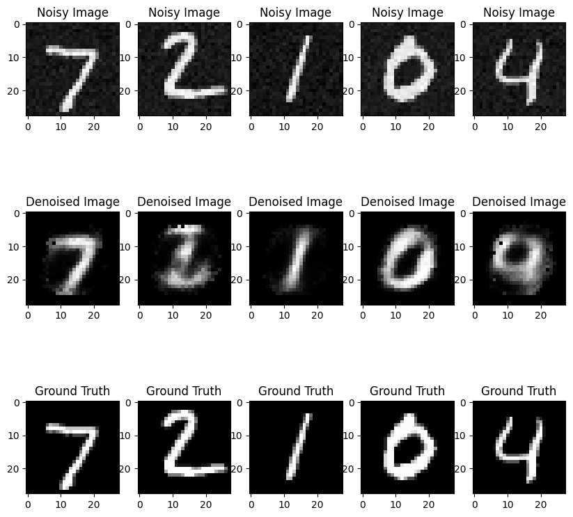

# Introduction
This project is a proof of concept for a Desoising Autoencoder, used to denoise images from the MNIST dataset

# Examples

# Evaluation
We can see that the Autoencoder is capable of removing the noise, learning the digits features. However, noise removal causes blurry shapes.